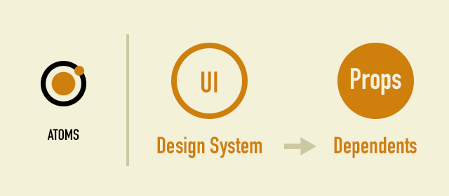
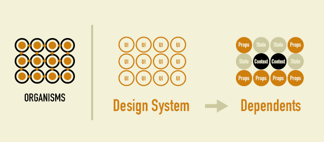
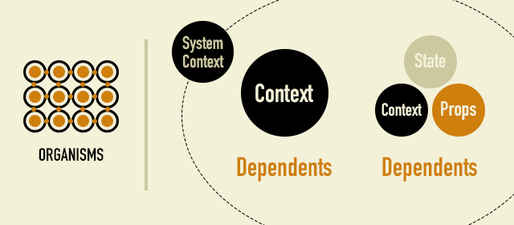

# Redefinition of Atoms - Atomic ReDesign -

"Atomic ReDesign" is an extension of the famous "Atomic Design". When designing components with React and Vue.js, we often had a headache. UI granularity classification constraints can prevent component design optimization.

There was no unified solution to the question, "Where do components of this granularity belong?", And it had to be determined by the nature of each product. Also, the scattered context caused a loss of concentration on the code.

Atomic ReDesign aims to capture the actual "difference between Atomic Design and application design" and become a realistic design guideline.

## The gap between Atomic Design and application design

The original Atomic Design is a design concept for building a design system. It is suitable for building a disciplined design system with the aim of increasing reusability with a modular UI. Before adopting this design concept as it is, there are some things to check.

"Is the design target a design system?"
If your design is an application, the answer to this question is "No". I think this is the difference between whether Atomic Design is operating well or not.

Atomic ReDesign that "redefines the atom" while keeping the convention of "atom = minimum module unit". This is based on the perspective that "the smallest unit of an indivisible module is not the UI" when building an application. The components of a component go beyond UI design. The smallest module unit advocated by Atomic ReDesign is "dependency".

## Redefinition of atoms

By redefining the atom, which is the smallest unit, as "dependence", we will see what kind of change there is.

